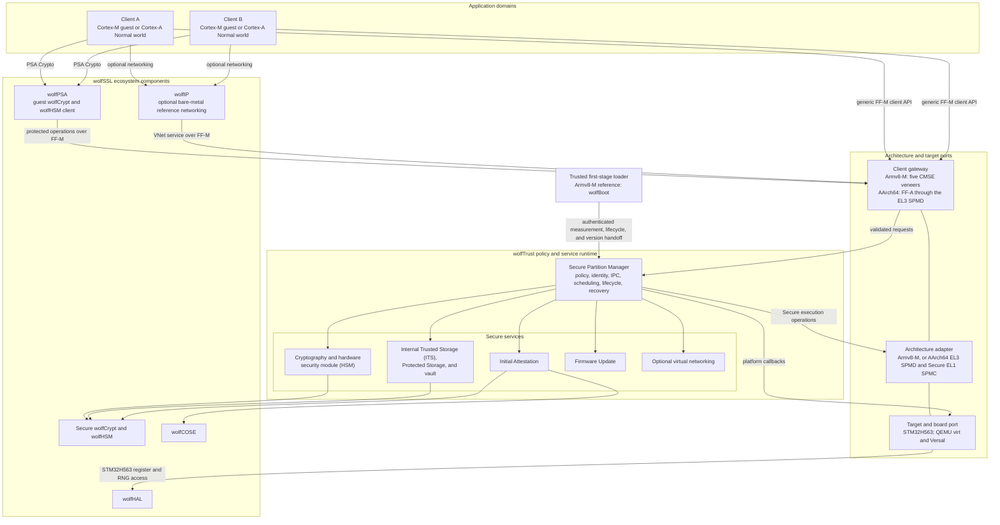

# wolfTrust

wolfTrust is a Secure Partition Manager (SPM) and secure-services runtime for
Arm Cortex-M and Cortex-A targets. It separates reusable policy and service
code from architecture- and target-specific execution and protection code. The
common runtime provides interprocess communication (IPC) through the Arm
Platform Security Architecture (PSA) Firmware Framework for M (FF-M), manifest
policy, lifecycle management, scheduling, fault recovery, and PSA services.

Two architecture ports share that runtime:

- **Armv8-M** with the STM32H563 Cortex-M33 port, the reference
  implementation validated on hardware.
- **AArch64** (Cortex-A), a Trusted Firmware-A replacement: an EL3 monitor
  that is the Arm Firmware Framework for A-profile (FF-A) Secure Partition
  Manager Dispatcher (SPMD), a Secure EL1 Secure Partition Manager Core (SPMC)
  that runs the same common runtime, and Secure Partitions at Secure EL0.
  Normal-world clients reach the services over FF-A v1.2. This port is
  validated under QEMU on `virt` (GICv2 and GICv3) and `xlnx-versal-virt`; no
  Cortex-A silicon port is validated yet. See
  [FF-A Compatibility](docs/FF-A-Compatibility.md).

Both ports keep the public manifest, service, IPC, and PSA API contracts;
AArch64 manifests add an optional FF-A section. Additional Cortex-M and
Cortex-A ports are an intended extension point.

## Architecture



### Current reference ports

On the STM32H563 reference chain, wolfBoot authenticates wolfTrust, Armv8-M
TrustZone isolates the Secure runtime from Non-secure guests, and STM32 Global
TrustZone Controller (GTZC) memory attribution isolates guest RAM. Zephyr and
FreeRTOS reference guests use wolfPSA's PSA Crypto API through five Cortex-M
Security Extensions (CMSE) gateway veneers. Those mechanisms describe the
current reference port, not a requirement imposed on every intended port.

On the QEMU AArch64 cells, the EL3 monitor boots first, programs the GIC, and
enters the Secure EL1 SPMC, which runs each Secure Partition at Secure EL0
under its own stage-1 translation table. A Normal-world payload at NS-EL1
reaches the services through FF-A direct requests that carry the PSA client
calls. No wolfBoot AArch64 port exists yet, so these targets have no
authenticated boot or boot handoff record; the handoff region is empty and
the services that depend on it fail closed.

## Quick start

For the initial Secure build and host tests, install GNU Make, Python 3, Git, a
native C compiler, and an `arm-none-eabi-` toolchain. Configure GitHub SSH
access before cloning because three configured submodule URLs use SSH. Guest
setup, conformance tests, emulator runs, and fresh hardware builds require
network access. See [Getting Started](docs/Getting-Started.md) for additional
emulator and hardware prerequisites.

The repository currently requires authorized GitHub access.

```sh
git clone --recurse-submodules https://github.com/wolfSSL/wolfTrust.git
cd wolfTrust
git submodule update --init --recursive
make
make test
```

The Secure build produces `build/wolftrust.elf`,
`build/wolftrust.bin`, and `build/secure_cmse_implib.o`.
Target runners assemble the wolfBoot-to-wolfTrust chain, patch
signature-covered guest measurements into wolfTrust, and then sign the
wolfTrust image.

The AArch64 build needs the `aarch64-none-elf-` toolchain, and its scenarios
need `qemu-system-aarch64`; the `ghcr.io/wolfssl/wolfboot-ci-aarch64`
container carries both:

```sh
make ARCH=aarch64 TARGET=qemuvirt
make test-target-a
```

The AArch64 build produces the EL3 monitor (`build/wolftrust_el3.elf`) and
the Secure EL1 SPMC (`build/wolftrust.elf`).

Build both PSA reference guests with:

```sh
make -C tests/firmware/zephyr-stm32h5 clone
make -C tests/firmware/zephyr-stm32h5 \
    build-guest0-psa build-freertos-guest1
```

Common validation entry points:

```sh
make test
make test-target
make test-target-a
make test-conformance
WT_H5_DOCKER_IMAGE=ghcr.io/wolfssl/wolfboot-ci-m33mu:v1.15 make test-hardware
```

`make test-target` skips explicitly when M33MU is unavailable, and
`make test-target-a` when QEMU or the AArch64 toolchain is.
`make test-conformance` instead runs its 20-test host subset and warns that it
is not full emulator or hardware evidence. `make test-hardware` skips when
board detection fails; on hosts without `lsusb`, a missing ST-Link can instead
surface as a flash failure. The hardware target can flash and reset the
connected board. Use the disposable build container for the published hardware
workflow; the current direct-host build path changes the user's global Git
`safe.directory` configuration.

## Documentation

The version-controlled documentation in [`docs/`](docs/) is the primary
documentation source:

- [Getting Started](docs/Getting-Started.md)
- [Architecture](docs/Architecture.md)
- [Crypto Engines](docs/Crypto-Engines.md)
- [Security Model](docs/Security-Model.md)
- [Threat Model](docs/Threat-Model.md)
- [API Reference](docs/API-Reference.md)
- [Services](docs/Services.md)
- [TF-M Compatibility](docs/TF-M-Compatibility.md)
- [FF-A Compatibility](docs/FF-A-Compatibility.md)
- [Macros](docs/Macros.md)
- [Porting](docs/Porting.md)
- [Building](docs/Building.md)
- [Testing](docs/Testing.md)
- [Project Structure](docs/Project-Structure.md)
- [STM32H5 Guide](docs/STM32H5-Guide.md)

The source tree is authoritative:

| Path | Authority |
| --- | --- |
| `include/` | Public APIs and integration contracts |
| `src/` | Runtime and Secure service behavior |
| `port/` | Target policy, memory layout, flash, entropy, and hardware enforcement |
| `mk/` | Build configuration and linked-image checks |

When enabled, the GitHub wiki is generated from the Markdown sources in
`docs/`.

## License

wolfTrust is licensed under the
[GNU General Public License, version 3 or later](LICENSE).
Submodules under `lib/` retain their own licenses.
