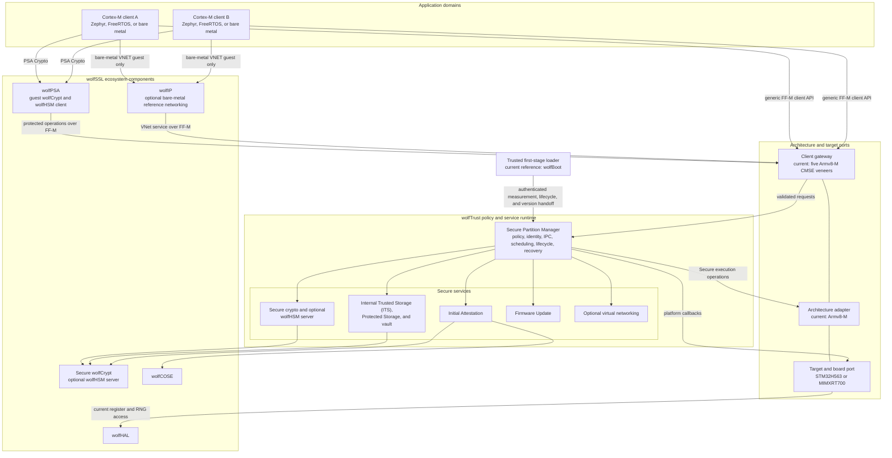

# wolfTrust

wolfTrust is a Secure Partition Manager (SPM) and secure-services runtime
designed for Cortex-M targets. It separates reusable policy and service code
from architecture- and target-specific execution and protection code. The
common runtime provides interprocess communication (IPC) through the Arm
Platform Security Architecture (PSA) Firmware Framework for M (FF-M), manifest
policy, lifecycle management, scheduling, fault recovery, and PSA services.

The Armv8-M adapter has two target ports: STM32H563 and NXP MIMXRT700. They
share the core runtime and architecture layer, with different device security
controls and validation coverage. See [Ports and supported targets](docs/Targets.md).

## Architecture


```mermaid
flowchart TB
    BOOT[Trusted first-stage loader<br/>current reference: wolfBoot]

    subgraph APP[Application domains]
        GA[Cortex-M client A<br/>Zephyr, FreeRTOS, or bare metal]
        GB[Cortex-M client B<br/>Zephyr, FreeRTOS, or bare metal]
    end

    subgraph PORT[Architecture and target ports]
        GW[Client gateway<br/>current: five Armv8-M CMSE veneers]
        ARCH[Architecture adapter<br/>current: Armv8-M]
        TARGET[Target and board port<br/>STM32H563 or MIMXRT700]
        GW --- ARCH
        ARCH --- TARGET
    end

    subgraph WT[wolfTrust policy and service runtime]
        SPM[Secure Partition Manager<br/>policy, identity, IPC, scheduling, lifecycle, recovery]
        subgraph SP[Secure services]
            CR["Secure crypto and optional<br/>wolfHSM server"]
            ST["Internal Trusted Storage (ITS),<br/>Protected Storage, and vault"]
            AT[Initial Attestation]
            FW[Firmware Update]
            VN[Optional virtual networking]
        end
        SPM --> CR
        SPM --> ST
        SPM --> AT
        SPM --> FW
        SPM --> VN
    end

    subgraph LIBS[wolfSSL ecosystem components]
        PSA[wolfPSA<br/>guest wolfCrypt and wolfHSM client]
        WC[Secure wolfCrypt<br/>optional wolfHSM server]
        COSE[wolfCOSE]
        HAL[wolfHAL]
        IP[wolfIP<br/>optional bare-metal reference networking]
    end

    BOOT -->|authenticated measurement, lifecycle, and version handoff| SPM
    GA -->|generic FF-M client API| GW
    GB -->|generic FF-M client API| GW
    GA -->|PSA Crypto| PSA
    GB -->|PSA Crypto| PSA
    PSA -->|protected operations over FF-M| GW
    GA -->|bare-metal VNET guest only| IP
    GB -->|bare-metal VNET guest only| IP
    IP -->|VNet service over FF-M| GW
    GW -->|validated requests| SPM
    SPM -->|Secure execution operations| ARCH
    SPM -->|platform callbacks| TARGET
    CR --> WC
    ST --> WC
    AT --> COSE
    AT --> WC
    TARGET -->|current register and RNG access| HAL
```

The optional wolfIP/VNET reference uses separate bare-metal guests, not the
Zephyr and FreeRTOS PSA guest pair.

### Current reference port

On the STM32H563 reference chain, wolfBoot authenticates wolfTrust, Armv8-M
TrustZone isolates the Secure runtime from Non-secure guests, and STM32 Global
TrustZone Controller (GTZC) memory attribution isolates guest RAM. Zephyr and
FreeRTOS reference guests use wolfPSA's PSA Crypto API through five Cortex-M
Security Extensions (CMSE) gateway veneers. The Secure side meets PSA FF-M
isolation level 3 ([Security Model](docs/Security-Model.md#ff-m-isolation-level-3)). Those mechanisms describe the
current reference port, not a requirement imposed on every intended port.

## Ports

wolfTrust currently supports two ports; each guide covers the board, the
first-stage loader contract, and the runners:

- STM32H563 (NUCLEO-H563ZI): [STM32H5 Guide](docs/STM32H5-Guide.md)
- NXP MIMXRT700 (MIMXRT700-EVK): [MIMXRT700 Guide](docs/MIMXRT700-Guide.md)

Both build with `TARGET=<port>` (`stm32h563` is the default). Each runs its
own smoke scenario set under M33MU with `make test-target TARGET=<port>`.

## Quick start

For the initial Secure build and host tests, install GNU Make, Python 3, Git, a
native C compiler, and an `arm-none-eabi-` toolchain. The repository and its
submodules use public HTTPS URLs; GitHub SSH setup is not required. Guest
builds also need CMake and Ninja; target tests need M33MU or a provisioned
NUCLEO-H563ZI with ST-Link, and the published hardware workflow uses Docker.
These workflows may fetch dependencies on first use. See
[Getting Started](docs/Getting-Started.md) for the full prerequisites.

```sh
git clone --recurse-submodules https://github.com/wolfSSL/wolfTrust.git
cd wolfTrust
make
make test
```

The Secure build produces `build/wolftrust.elf`,
`build/wolftrust.bin`, and `build/secure_cmse_implib.o`.
Target runners assemble the wolfBoot-to-wolfTrust chain, patch
signature-covered guest measurements into wolfTrust, and then sign the
wolfTrust image.

Build both PSA reference guests with:

```sh
make -C tests/firmware/zephyr-stm32h5 clone
make -C tests/firmware/zephyr-stm32h5 \
    build-guest0-psa build-freertos-guest1
```

Common validation entry points:

```sh
make test
make test-target
make test-target TARGET=mimxrt700
make test-conformance
WT_H5_DOCKER_IMAGE=ghcr.io/wolfssl/wolfboot-ci-m33mu:v1.15 make test-hardware
```

`make test-target` runs the port's smoke tier under M33MU (`WT_TIER=full` for
every scenario): the STM32H563 default skips explicitly when M33MU is
unavailable, and `TARGET=mimxrt700` builds its pinned emulator and wolfBoot
first stage itself.
`make test-conformance` instead runs its 20-test host subset and warns that it
is not full emulator or hardware evidence. `make test-hardware` skips when
board detection fails; on hosts without `lsusb`, a missing ST-Link can instead
surface as a flash failure. The hardware target can flash and reset the
connected board. Use the disposable build container for the published hardware
workflow; the current direct-host build path changes the user's global Git
`safe.directory` configuration.

## Documentation

The version-controlled documentation in [`docs/`](docs/) is the primary
documentation source:

- [Getting Started](docs/Getting-Started.md)
- [Ports and supported targets](docs/Targets.md)
- [MIMXRT700 Guide](docs/MIMXRT700-Guide.md)
- [Architecture](docs/Architecture.md)
- [Security Model](docs/Security-Model.md)
- [Threat Model](docs/Threat-Model.md)
- [API Reference](docs/API-Reference.md)
- [Services](docs/Services.md)
- [Standards and Claims](docs/Standards.md)
- [FF-M Compatibility](docs/FF-M-Compatibility.md)
- [PSA Compatibility](docs/PSA-Compatibility.md)
- [Footprint Comparison](docs/Footprint-Comparison.md)
- [Macros](docs/Macros.md)
- [Porting](docs/Porting.md)
- [Building](docs/Building.md)
- [Testing](docs/Testing.md)
- [Project Structure](docs/Project-Structure.md)
- [STM32H5 Guide](docs/STM32H5-Guide.md)

The source tree is authoritative:

| Path | Authority |
| --- | --- |
| `include/` | Public APIs and integration contracts |
| `src/` | Runtime and Secure service behavior |
| `port/` | Target policy, memory layout, flash, entropy, and hardware enforcement |
| `mk/` | Build configuration and linked-image checks |

`mkdocs.yml` defines the manual navigation. The shared
[`wolfSSL/documentation`](https://github.com/wolfSSL/documentation) tooling
builds HTML and PDF from these pages. [DOCS-BUILD.md](DOCS-BUILD.md) explains
local previews and how merged changes reach the website.

## License

wolfTrust is licensed under the
[GNU General Public License, version 3 or later](LICENSE).
Submodules under `lib/` retain their own licenses.
