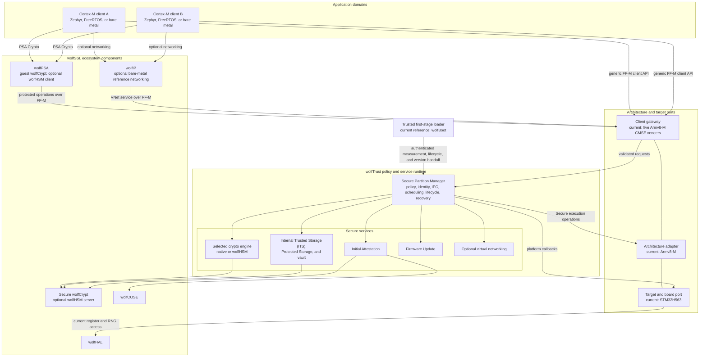

# wolfTrust

wolfTrust is a Secure Partition Manager (SPM) and secure-services runtime
designed for Cortex-M targets. It separates reusable policy and service code
from architecture- and target-specific execution and protection code. The
common runtime implements Arm Platform Security Architecture (PSA) Firmware
Framework for M (FF-M) interprocess communication (IPC), manifest policy,
scheduling, lifecycle management, fault recovery, and services.

The only currently supported and validated reference implementation combines
the Armv8-M adapter with the STM32H563 Cortex-M33 port. Support for additional
Cortex-M ports is an intended extension point. Such ports may reuse the common
runtime and, where applicable, the Armv8-M layer. Cortex-A support is an
architectural goal, not a current capability. It will require a new adapter and
changes to current internal execution and protection contracts; the design goal
is to preserve the public manifest, service, IPC, and PSA API contracts.

## Architecture

### Current reference port

In the STM32H563 reference chain, wolfBoot authenticates wolfTrust, TrustZone
isolates the Secure runtime from Non-secure guests, and STM32 Global TrustZone
Controller (GTZC) memory attribution isolates guest RAM. The Zephyr and
FreeRTOS reference guests use wolfPSA's PSA Crypto API through the Armv8-M
port's five CMSE gateway veneers.

## Key Features

| Feature | Description |
| --- | --- |
| Authenticated chain | The boot port supplies authenticated measurement, lifecycle, and version data. The reference integration uses wolfBoot and signature-covered guest records. |
| One mediated client boundary | Application domains reach services only through the client gateway supplied by the architecture port. The current Armv8-M image exports exactly five `WolfTrust_FFM_*` veneers. |
| Caller-bound IPC | wolfTrust derives the PSA client identity from the active application domain, copies vector descriptors, checks every range, and enforces manifest access policy. |
| Port-defined isolation | Each port declares and enforces the protection capabilities required by its manifest. The STM32H563 reference uses TrustZone, the Secure MPU, and GTZC MPCBB attribution; its exact limits are documented in [Security Model](Security-Model.md). |
| PSA cryptography | Zephyr and FreeRTOS reference guests call wolfPSA's PSA Crypto API. The default native engine runs wolfCrypt in each guest and obtains DRBG seeds from the Secure vault; the optional wolfHSM engine routes supported operations to per-guest Secure server namespaces. |
| Secure services | Connection-based services provide the selected crypto engine, attestation, Internal Trusted Storage (ITS), Protected Storage, firmware update, and an optional Secure virtual Ethernet switch. The optional bare-metal networking guests run wolfIP outside the Secure image. |
| Fault containment | A guest fault either restarts the guest within policy limits or leaves it quarantined. A Secure Partition fault releases synchronization state before failing affected calls. Restart paths scrub declared private writable memory before rearming; forbidden, exhausted, or failed recovery escalates to the port's fail-closed path. |
| Static Secure memory | The Secure image is built with `WOLFSSL_NO_MALLOC` and `NO_WOLFSSL_MEMORY`; service buffers, stacks, and state are statically allocated. |

## Documentation

| Page | Contents |
| --- | --- |
| [Getting Started](Getting-Started.md) | Prerequisites, checkout, first builds, emulator use, and hardware entry points |
| [Architecture](Architecture.md) | Boot flow, isolation layers, FF-M IPC, services, and scheduling |
| [Crypto Engines](Crypto-Engines.md) | Native and wolfHSM engine behavior, selection, key models, and measured cost |
| [Security Model](Security-Model.md) | Trust boundaries and enforced security properties |
| [Threat Model](Threat-Model.md) | Protected assets, attacker capabilities, controls, and residual risks |
| [API Reference](API-Reference.md) | PSA client, service, storage, update, lifecycle, attestation, and gateway APIs |
| [Services](Services.md) | Behavior and access policy for each Secure service |
| [TF-M Compatibility](TF-M-Compatibility.md) | Supported interfaces, intentional differences, and migration guidance |
| [Macros](Macros.md) | Supported build and manifest configuration |
| [Porting](Porting.md) | Architecture and target port contracts |
| [Building](Building.md) | Build targets, outputs, and cross-build options |
| [Testing](Testing.md) | Host, M33MU, and STM32H563 validation |
| [Project Structure](Project-Structure.md) | Repository layout |
| [STM32H5 Guide](STM32H5-Guide.md) | STM32H563 provisioning, flashing, WRP, and recovery safety |
